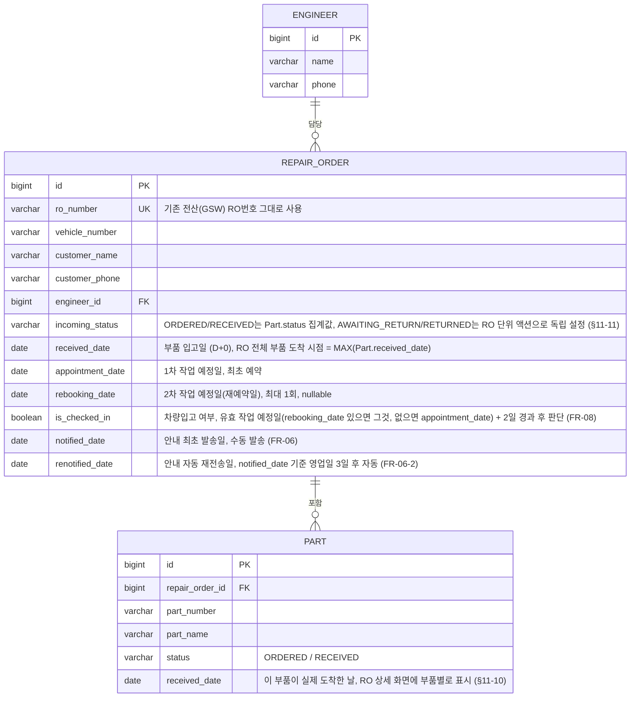

# ERD (v0.3)

PRD(`부품관리시스템_PRD.md`) v0.3 기준 데이터 모델. 3차 클라이언트 피드백으로 반품 처리 단위가
**RO 단위로 확정**되면서(§11-11), v0.2에서 "Part.status가 단일 진실 공급원" 이었던 설계가
일부 되돌아갔다 — 초기 단계(주문/입고)는 여전히 Part 집계, 반품 관련(§11-11 확정 이후)은 RO 단위
독립 액션으로 분리되었다.

## 상태 전이 요약

### Part.status (2단계, 초기 단계 전용)

`ORDERED → RECEIVED`

- `ORDERED`: RO 접수(FR-01) 시 부품 목록과 함께 생성되는 기본값. 접수 즉시 모비스에 주문 처리된 것으로 간주하며, "미주문" 같은 별도 대기 상태는 두지 않는다 (§11-14 확정)
- `RECEIVED`: 개별 부품이 실제 도착했을 때 그 Part만 전환 (부품마다 도착 시점이 다름, FR-03)
- API 레벨에서 전이 순서를 강제 검증하지 않는다 (1인 운영 내부 도구, API명세.md 참고)
- v0.2까지는 `AWAITING_ORDER`(미주문) → `ORDERED` → `RECEIVED` → `AWAITING_RETURN` → `RETURNED` 5단계였으나, §11-11(반품 처리는 무조건 RO 단위) 확정으로 부품 단위 반품 상태가 삭제되고, §11-14(접수 즉시 주문중 시작) 확정으로 `AWAITING_ORDER`도 삭제되어 지금의 2단계만 남음

### RepairOrder.incoming_status (4단계, 단계별로 출처가 다름)

`ORDERED → RECEIVED → AWAITING_RETURN → RETURNED`

- **`ORDERED` / `RECEIVED`**: 그 RO에 걸린 Part들의 status를 집계한 파생값 (RO에 걸린 Part들의 status 중 가장 진행이 덜 된 값을 취함, 예: 부품 2개 중 하나만 `RECEIVED`고 하나는 아직 `ORDERED`면 → RO는 `ORDERED`). §11-1 참고
- **`AWAITING_RETURN`**: Part 집계가 아니라 **RO 단위로 직접 설정**되는 값. 트리거: ①안내 재전송 후 영업일 3일 무응답 ②재예약 연락두절 ③2차 작업 예정일 노쇼 재발 (FR-07, FR-09) — 셋 다 "고객 응대 자체가 종료됨"을 뜻하며, RO 하나 전체에 대해 한 번에 전환된다 (부품별 개별 전환 없음, §11-11)
- **`RETURNED`**: 관리자/접수담당이 FR-14로 그 RO의 '반품 처리 완료' 체크를 남길 때 RO 단위로 직접 설정 (실제 반품 신청은 GSW 등 외부 시스템에서 처리, §11-2 — 이 시스템은 완료 체크만 받음)
- v0.2에서는 `AWAITING_RETURN`/`RETURNED`도 Part.status 집계 파생값이었고, 반품기한(30일) 임박 시 부품 개별로 자동 전환되는 4번째 트리거(FR-11-1)도 있었으나, §11-11(반품 RO 단위 확정)로 삭제되고 지금 구조로 단순화됨. 반품기한 자동 강조 기능 자체의 폐기 사유는 §11-11 참고

### 기타 필드

- `is_checked_in`: 유효 작업 예정일(`rebooking_date`가 있으면 그것, 없으면 `appointment_date`) + 2일 경과 시점에 배치가 확인. `false`면 노쇼 → 엔지니어 알림 (FR-08)
- `rebooking_date`가 이미 있는 상태(재예약 1회 소진)에서 다시 노쇼/연락두절 발생 시 더 이상 재예약 유도 없이 RO를 `AWAITING_RETURN` 전환 (FR-09, FR-10)
- `renotified_date`: `notified_date`이 있는 상태에서 영업일 3일 경과 & 예약 없음(`appointment_date` 미등록) 조건이면 배치가 이 값을 채우며 안내를 재전송 (FR-06-2). 이후 다시 영업일 3일이 지나도 예약이 없으면 `AWAITING_RETURN` 전환 (FR-07, §11-12 최종 대기기간 확인 필요)

## RO 레벨 vs Part 레벨, 왜 각각 필요한가

- **`RepairOrder.received_date`** (= 모든 Part 중 가장 늦게 도착한 날짜): **고객 안내** 기준. §11-1에 따라 일부 부품만 와서는 고객에게 오라고 할 수 없어서, 전체 도착일을 기준으로 안내 발송 여부를 판단
- **`Part.received_date`** (부품별 실제 도착일): v0.2에서는 부품별 반품기한 자동 계산·강조에 사용됐으나, 그 기능 자체가 삭제됨(§11-11). v0.3에서는 순수하게 **RO 상세 화면에 부품별 입고 이력을 보여주기 위한 표시용 데이터**로만 남음 (§11-10 확정)

## 기존 코드(v0.1/v0.2) 대비 변경 필요 필드

| 기존/이전 필드 | 처리 |
|---|---|
| `appointmentDate` (v0.2, 단일 필드+덮어쓰기) | `appointment_date`(1차) / `rebooking_date`(2차) 두 컬럼으로 분리 |
| `isRebooked` (v0.2, boolean) | **삭제** — `rebooking_date` 값 존재 여부로 파생 가능 |
| `notification1SentAt` | `notified_date`으로 명칭 정리 |
| `notification2SentAt` / `finalNotificationSentAt` | 삭제 (v0.2에서 이미 삭제됨) |
| — | `renotified_date` 신규 추가 (FR-06-2 안내 자동 재전송 추적용) |
| `Part.status`의 `AWAITING_RETURN`/`RETURNED` (v0.2) | **삭제** — 반품은 RO 단위로만 처리 (§11-11) |
| `Part.status`/`incoming_status`의 `AWAITING_ORDER` (v0.2) | **삭제** — 접수 즉시 `ORDERED`로 시작, "미주문" 대기 상태 자체가 불필요함 (§11-14) |
| `RepairOrder.incoming_status`가 항상 Part 집계 파생값이던 것 (v0.2) | `AWAITING_RETURN`/`RETURNED`는 더 이상 Part 집계가 아니라 **RO 단위 직접 설정값**으로 변경 |
| `returnProcessed` (v0.1) | FR-14로 대체, RO 단위로 명확화 |
