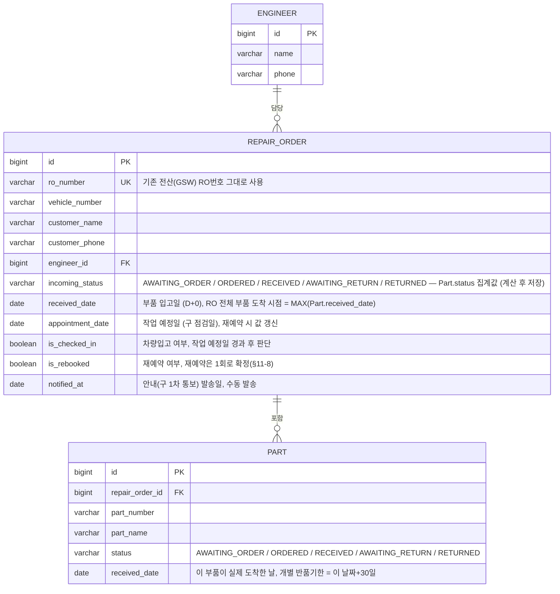

# ERD (v0.2)

PRD(`부품관리시스템_PRD.md`) v0.2 기준 데이터 모델. 기존 코드(`RepairOrder.java`)의
`notification2SentAt`, `finalNotificationSentAt`는 2차/최종 통보 폐지로 제거 대상.

## 상태 전이 요약

**`Part.status`가 단일 진실 공급원**이고, `RepairOrder.incoming_status`는 그 RO에 걸린 모든 Part.status를
집계한 파생값이다 (§11-1: "상태값은 RO 전체가 공유"). 저장은 하되(조회 성능), 값은 항상 Part 집계로 갱신된다.

- `Part.status`: `AWAITING_ORDER → ORDERED → RECEIVED → AWAITING_RETURN → RETURNED`
  - `AWAITING_ORDER`: RO 접수(FR-01) 시 부품 목록과 함께 생성되는 기본값
  - `ORDERED`: 부품 주문 처리(FR-02) 시 `PATCH .../parts`로 개별 Part를 전환 (선택적 기록용, 다음 단계로 가기 위한 필수 관문 아님 — `RECEIVED`로 바로 전환해도 됨)
  - `RECEIVED`: 개별 부품이 실제 도착했을 때 `PATCH`로 그 Part만 전환 (부품마다 도착 시점이 다름, FR-03). 직전 상태가 `AWAITING_ORDER`든 `ORDERED`든 상관없이 전환 가능
  - `AWAITING_RETURN`: 4가지 트리거로 전환. ①안내 후 3영업일 무응답 ②재예약 연락두절 ③재예약 노쇼 재발 — 이 셋은 고객 응대 자체가 종료된 것이라 배치가 **그 RO에 걸린 모든 Part를 일괄 전환**(부품 개별 사정이 아니라 RO 전체가 같은 운명을 공유, §11-1). ④반품기한(30일) 임박(D-N일 전, N은 §11-13 확인 필요) — 이건 부품마다 실제 도착일이 달라서 **그 부품 하나만** 개별 전환 (FR-11-1)
  - `AWAITING_RETURN`이어도 그 RO에 아직 지나지 않은 `appointment_date`가 있으면(트리거 ④로 전환된 경우에 흔함) 화면상 '진행중' 탭에 남지만, 행은 빨간색으로 강조 표시 (FR-11-1). §API명세.md 탭 판별 로직 참고
  - `RETURNED`: 직원이 부품별로 GSW 반품 처리를 완료 체크할 때 `PATCH`로 그 Part만 전환 (실제 반품 신청은 GSW 등 외부 시스템, §11-2 — 이 시스템은 완료 체크만 받음)
  - API 레벨에서 전이 순서를 강제 검증하지 않는다 (1인 운영 내부 도구, API명세.md 참고) — 다만 애초에 `RECEIVED` 이전 상태에서 `RETURNED`로 건너뛰는 것처럼 논리적으로 말이 안 되는 값을 입력하는 건 사용자(직원) 책임
- `RepairOrder.incoming_status` 집계 규칙 (우선순위 순):
  1. **부품 중 하나라도 `AWAITING_RETURN`이면 RO도 `AWAITING_RETURN`** (예외적 우선 규칙 — 트리거 ④ 때문에 한 부품만 개별로 `AWAITING_RETURN`이 될 수 있는데, 이 경우도 RO 전체가 "관심 필요" 상태로 보여야 하므로 다른 부품 진행 상황과 무관하게 최우선 적용)
  2. 그 외에는 **RO에 걸린 Part들의 status 중 가장 진행이 덜 된 값**을 RO의 상태로 삼는다 (예: 부품 2개 중 하나만 `RECEIVED`고 하나는 아직 `ORDERED`면 → RO는 `ORDERED`). 모든 Part가 `RETURNED`가 되는 순간 RO도 `RETURNED`
- `is_checked_in`: 작업 예정일 도래 시 배치가 확인, `false`면 노쇼 → 엔지니어 재통보
- `is_rebooked=true`인 상태(이미 재예약 1회 소진)에서 다시 노쇼/연락두절 발생 시 더 이상 재예약 유도 없이 해당 RO의 모든 Part를 `AWAITING_RETURN` 전환

## TODO: §11-10 답변 후 반영 (직접 수정 예정)

`Part.received_date`를 화면에 노출할 필요가 있는지(§11-10) 클라이언트 확인 대기 중.

- **노출 필요** → 화면(RO 상세) 수정 필요
- **노출 불필요** → `received_date` 필드 자체를 없애고 BaseEntity의 `updatedAt`으로 대체 검토 가능
  - ⚠️ 단, `updatedAt`은 그 이후 상태 전환(`AWAITING_RETURN`, `RETURNED`)에서도 계속 갱신되므로, RECEIVED 시점의 값이 덮어써짐 — 반품기한 계산(도착일+30일)에 쓰려면 RECEIVED로 전환된 시점의 값을 별도로 남겨야 함. 그대로 `updatedAt`만 쓰면 나중에 반품 처리할 때 원래 도착일을 잃어버림

## RO 레벨 vs Part 레벨, 왜 각각 필요한가

- **`RepairOrder.received_date`** (= 모든 Part 중 가장 늦게 도착한 날짜): **고객 통보** 기준. §11-1에 따라 일부 부품만 와서는 고객에게 오라고 할 수 없어서, 전체 도착일을 기준으로 D+0을 잡음
- **`Part.received_date`** (부품별 실제 도착일): **개별 반품 기한** 기준. 부품마다 도착일이 다르면 반품 기한(도착일+30일)도 달라짐. RO의 최종 도착일로만 계산하면 먼저 온 부품이 자기 반품 기한을 넘겨도 시스템이 놓칠 수 있음 — 이 프로젝트의 핵심 목적(§1-2, §9 KPI: 반품기한 초과 0건)과 정면으로 배치되므로 **부품별로 반드시 따로 추적**

## 기존 코드 대비 변경 필요 필드

| 기존 필드 | 처리 |
|---|---|
| `appointmentDate` | `appointment_date`로 유지 (재예약 시 값 덮어씀) |
| `notification1SentAt` | `notified_at`으로 명칭 정리 (의미: 자동 D+3 → 수동 발송으로 트리거만 변경) |
| `notification2SentAt` | 삭제 |
| `finalNotificationSentAt` | 삭제 |
| `returnProcessed` | 삭제 (RO의 `RETURNED`는 Part 상태 집계로 대체) |
| `received`(Part, boolean) | `status`(enum, 5단계)로 변경 |
| `IncomingStatus.ORDER_PLACED` | `ORDERED`로 명칭 정리 |
| `IncomingStatus.RETURN_PENDING` | `AWAITING_RETURN`으로 명칭 정리 (`AWAITING_ORDER`와 네이밍 패턴 통일) |
| `IncomingStatus`(4단계, RO 전용 저장값) | `AWAITING_ORDER` 추가로 5단계 확장 + **Part.status 집계 파생값으로 성격 변경** (더 이상 RO가 독자적으로 상태를 전환하지 않음) |
| — | `Part.status`에 `AWAITING_ORDER`, `AWAITING_RETURN` 추가 (RO와 동일한 5단계) |
| — | `Part.received_date` 신규 추가 (개별 반품기한 계산용) |
| — | `is_checked_in`, `is_rebooked` 신규 추가 |
